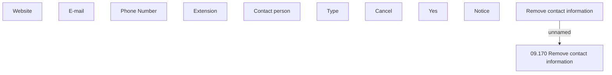

# Remove Contact Information

- **Diagram Type**: Custom
- **Package**: HomerSelect/BSL/Analysis Model/Sales Network Management/COMMON for Sales Network Management/SN Contact Information/User Interface
- **Diagram ID**: 115910
- **Elements**: 11
- **Connectors**: 1

