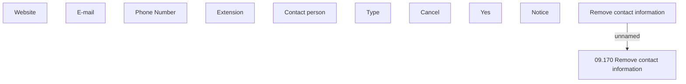

# Remove Contact Information

```mermaid
graph TD
    Website["Website"]
    E_mail["E-mail"]
    Phone_Number["Phone Number"]
    Extension["Extension"]
    Contact_person["Contact person"]
    Type["Type"]
    n_09_170_Remove_contact_information["09.170 Remove contact information"]
    Cancel["Cancel"]
    Yes["Yes"]
    Notice["Notice"]
    Remove_contact_information["Remove contact information"]
    Remove_contact_information -->|unnamed| n_09_170_Remove_contact_information
```
