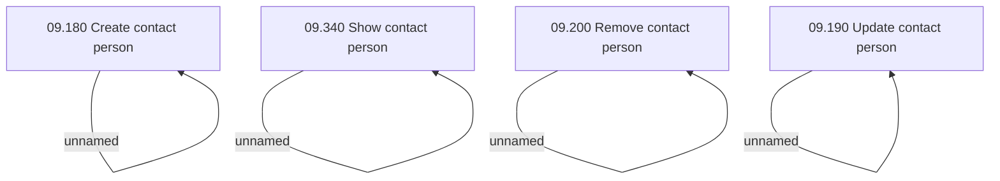

# Access Rights

- **Diagram Type**: Custom
- **Package**: HomerSelect/BSL/Analysis Model/Sales Network Management/COMMON for Sales Network Management/SN Contact Person/Access Rights
- **Diagram ID**: 39177
- **Elements**: 8
- **Connectors**: 4

