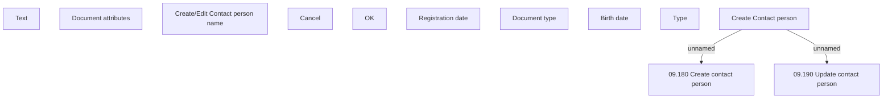

# Create/Update contact person

- **Diagram Type**: Custom
- **Package**: HomerSelect/BSL/Analysis Model/Sales Network Management/COMMON for Sales Network Management/SN Contact Person/User Interface
- **Diagram ID**: 72002
- **Elements**: 12
- **Connectors**: 2

