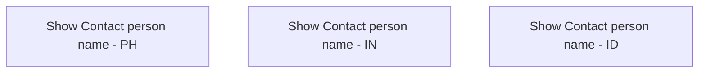

# Show Contact person name

- **Diagram Type**: Custom
- **Package**: HomerSelect/BSL/Analysis Model/Sales Network Management/COMMON for Sales Network Management/SN Contact Person/User Interface/Contact person name
- **Diagram ID**: 56711
- **Elements**: 3
- **Connectors**: 0

