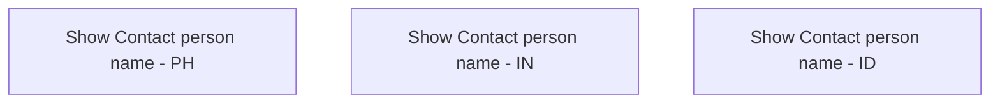

# Show Contact person name

```mermaid
graph TD
    Show_Contact_person_name_PH["Show Contact person name - PH"]
    Show_Contact_person_name_IN["Show Contact person name - IN"]
    Show_Contact_person_name_ID["Show Contact person name - ID"]
```
