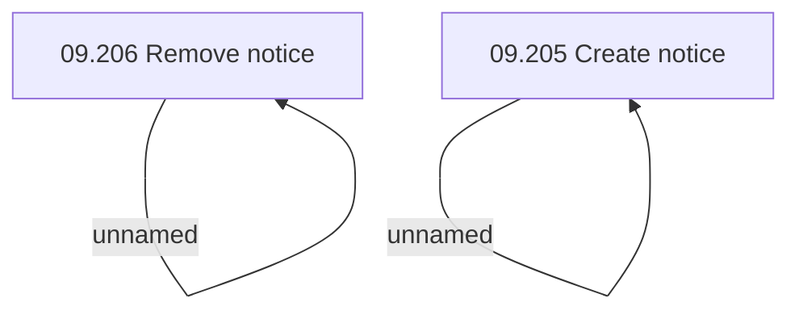

# Access Rights

- **Diagram Type**: Custom
- **Package**: HomerSelect/BSL/Analysis Model/Sales Network Management/COMMON for Sales Network Management/SN Notice/Access Rights
- **Diagram ID**: 97936
- **Elements**: 4
- **Connectors**: 2

