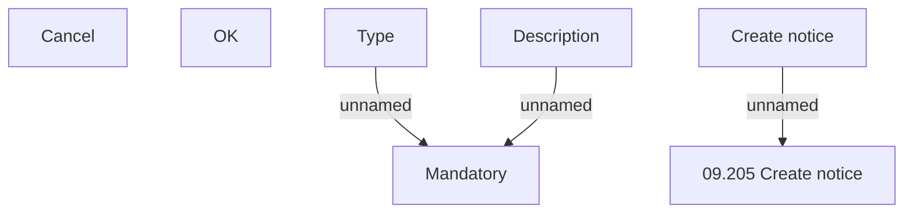

# Create Notice

- **Diagram Type**: Custom
- **Package**: HomerSelect/BSL/Analysis Model/Sales Network Management/COMMON for Sales Network Management/SN Notice/User Interface
- **Diagram ID**: 72014
- **Elements**: 7
- **Connectors**: 3

