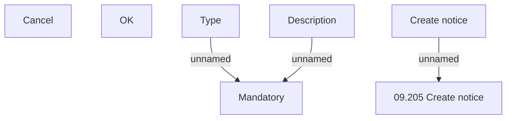

# Create Notice

```mermaid
graph TD
    Cancel["Cancel"]
    OK["OK"]
    Description["Description"]
    n_09_205_Create_notice["09.205 Create notice"]
    Type["Type"]
    Create_notice["Create notice"]
    Mandatory["Mandatory"]
    Create_notice -->|unnamed| n_09_205_Create_notice
    Type -->|unnamed| Mandatory
    Description -->|unnamed| Mandatory
```
