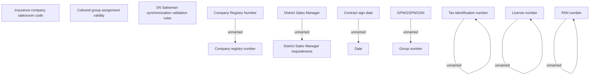

# SNM validations - Common

- **Diagram Type**: Custom
- **Package**: HomerSelect/BSL/Analysis Model/Sales Network Management/COMMON for Sales Network Management/«functionality» COMMON for Common for Sales Network Management/Validation rules/Common for all variants
- **Diagram ID**: 71505
- **Elements**: 17
- **Connectors**: 7

