# SNM validations - PH

- **Diagram Type**: Custom
- **Package**: HomerSelect/BSL/Analysis Model/Sales Network Management/COMMON for Sales Network Management/«functionality» COMMON for Common for Sales Network Management/Validation rules/PH
- **Diagram ID**: 62756
- **Elements**: 23
- **Connectors**: 14

```mermaid
graph TD
    Partner_License_number_requisiteness_PH["Partner License number requisiteness - PH"]
    Partner_License_number_requisiteness_PH["Partner License number requisiteness - PH"]
    Partner_License_number_length_PH["Partner License number length - PH"]
    Partner_License_number_PH["Partner License number - PH"]
    Partner_PAN_number_requisiteness_PH["Partner PAN number requisiteness - PH"]
    Partner_PAN_number_requisiteness_PH["Partner PAN number requisiteness - PH"]
    Partner_Tax_identification_number_requisiteness_PH["Partner Tax identification number requisiteness - PH"]
    District_Sales_Manager_requisiteness["District Sales Manager requisiteness"]
    PAN_number_PH["PAN number - PH"]
    District_Sales_Manager_requisiteness["District Sales Manager requisiteness"]
    Optional["Optional"]
    Tax_identification_number_requisiteness_PH["Tax identification number requisiteness - PH"]
    PAN_number_PH["PAN number - PH"]
    PAN_number_PH["PAN number - PH"]
    PAN_number["PAN number"]
    Company_Registry_Number_PH["Company Registry Number - PH"]
    Company_Registry_Number_PH["Company Registry Number - PH"]
    Company_Registry_Number["Company Registry Number"]
    Branch_license_number_PH["Branch license number - PH"]
    Branch_license_number_Length_PH["Branch license number Length - PH"]
    Tax_identification_number_PH["Tax identification number - PH"]
    Tax_identification_number["Tax identification number"]
    Tax_identification_number["Tax identification number"]
    Tax_identification_number -->|unnamed| Tax_identification_number_PH
    Branch_license_number_PH -->|unnamed| Branch_license_number_Length_PH
    Tax_identification_number -->|unnamed| Tax_identification_number
    Company_Registry_Number_PH -->|unnamed| Company_Registry_Number
    Company_Registry_Number_PH -->|unnamed| Company_Registry_Number_PH
    PAN_number_PH -->|unnamed| PAN_number
    PAN_number_PH -->|unnamed| PAN_number_PH
    Tax_identification_number_requisiteness_PH -->|unnamed| Optional
    District_Sales_Manager_requisiteness -->|unnamed| District_Sales_Manager_requisiteness
    PAN_number_PH -->|unnamed| District_Sales_Manager_requisiteness
    Tax_identification_number_requisiteness_PH -->|unnamed| Partner_Tax_identification_number_requisiteness_PH
    Partner_PAN_number_requisiteness_PH -->|unnamed| Partner_PAN_number_requisiteness_PH
    Partner_License_number_PH -->|unnamed| Partner_License_number_length_PH
    Partner_License_number_requisiteness_PH -->|unnamed| Partner_License_number_requisiteness_PH
```

