# Partner - Access Rights

- **Diagram Type**: Custom
- **Package**: HomerSelect/BSL/Analysis Model/Sales Network Management/Partner/COMMON for Partner/Access Rights
- **Diagram ID**: 139390
- **Elements**: 24
- **Connectors**: 19

```mermaid
graph TD
    n_09_030_Show_partner_Extended_properties_tab["09.030 Show partner - Extended properties tab"]
    n_09_030_Show_partner_Salesroom_tab["09.030 Show partner - Salesroom tab"]
    n_09_030_Show_partner_Address_tab["09.030 Show partner - Address tab"]
    n_09_030_Show_partner_Bank_account_tab["09.030 Show partner - Bank account tab"]
    n_09_030_Show_partner_Contact_person_tab["09.030 Show partner - Contact person tab"]
    n_09_030_Show_partner_Contact_information_tab["09.030 Show partner - Contact information tab"]
    n_09_030_Show_partner_Notice_tab["09.030 Show partner - Notice tab"]
    DEL_09_010_Create_partner_risk_data["{DEL}09.010 Create partner (risk data)"]
    DEL_09_010_Create_partner_basic_data["{DEL}09.010 Create partner (basic data)"]
    Partner_Risk_data["Partner Risk data"]
    n_09_210_Set_payment_status_for_Partner_manually["09.210 Set payment status for Partner manually"]
    n_09_050_Find_partner["09.050 Find partner"]
    n_09_040_Change_status_of_partner_manually["09.040 Change status of partner manually"]
    n_09_030_Show_partner["09.030 Show partner"]
    DEL_09_020_Update_partner_risk_data["{DEL}09.020 Update partner (risk data)"]
    DEL_09_020_Update_partner_basic_data["{DEL}09.020 Update partner (basic data)"]
    n_09_050_Find_partner["09.050 Find partner"]
    n_09_210_Set_payment_status_for_Partner_manually["09.210 Set payment status for Partner manually"]
    n_09_040_Change_status_of_partner_manually["09.040 Change status of partner manually"]
    n_09_030_Show_partner["09.030 Show partner"]
    DEL_09_010_Create_partner["{DEL}09.010 Create partner"]
    DEL_09_020_Update_partner["{DEL}09.020 Update partner"]
    DEL_09_010_Create_partner["{DEL}09.010 Create partner"]
    DEL_09_020_Update_partner["{DEL}09.020 Update partner"]
    n_09_030_Show_partner -->|unnamed| n_09_030_Show_partner_Extended_properties_tab
    n_09_030_Show_partner -->|unnamed| n_09_030_Show_partner_Address_tab
    n_09_030_Show_partner -->|unnamed| n_09_030_Show_partner
    n_09_030_Show_partner -->|unnamed| n_09_030_Show_partner_Contact_information_tab
    n_09_030_Show_partner -->|unnamed| n_09_030_Show_partner_Contact_person_tab
    n_09_030_Show_partner -->|unnamed| n_09_030_Show_partner_Bank_account_tab
    n_09_030_Show_partner -->|unnamed| n_09_030_Show_partner_Salesroom_tab
    n_09_030_Show_partner -->|unnamed| n_09_030_Show_partner_Notice_tab
    DEL_09_020_Update_partner -->|unnamed| DEL_09_020_Update_partner_basic_data
    DEL_09_020_Update_partner -->|unnamed| DEL_09_020_Update_partner
    DEL_09_020_Update_partner -->|unnamed| Partner_Risk_data
    DEL_09_020_Update_partner -->|unnamed| DEL_09_020_Update_partner_risk_data
    n_09_210_Set_payment_status_for_Partner_manually -->|unnamed| n_09_210_Set_payment_status_for_Partner_manually
    n_09_040_Change_status_of_partner_manually -->|unnamed| n_09_040_Change_status_of_partner_manually
    DEL_09_010_Create_partner -->|unnamed| Partner_Risk_data
    DEL_09_010_Create_partner -->|unnamed| DEL_09_010_Create_partner_risk_data
    DEL_09_010_Create_partner -->|unnamed| DEL_09_010_Create_partner
    DEL_09_010_Create_partner -->|unnamed| DEL_09_010_Create_partner_basic_data
    n_09_050_Find_partner -->|unnamed| n_09_050_Find_partner
```

