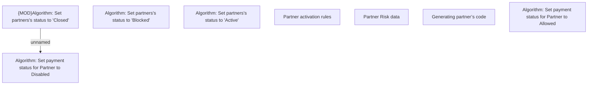

# Partner - Business Rules

- **Diagram Type**: Custom
- **Package**: HomerSelect/BSL/Analysis Model/Sales Network Management/Partner/COMMON for Partner/Business Rules/Common for all variants
- **Diagram ID**: 104422
- **Elements**: 8
- **Connectors**: 1

