# Create/Update partner

- **Diagram Type**: Custom
- **Package**: HomerSelect/BSL/Analysis Model/Sales Network Management/Partner/COMMON for Partner/User Interface
- **Diagram ID**: 132922
- **Elements**: 23
- **Connectors**: 2

```mermaid
graph TD
    ADD_Partner_Settlement_allowed["{ADD}Partner Settlement allowed"]
    Legal_Form["Legal Form"]
    Edit_available_disbursement_channels["Edit available disbursement channels"]
    DEL_09_020_Update_partner["{DEL}09.020 Update partner"]
    DEL_09_010_Create_partner["{DEL}09.010 Create partner"]
    Company_Registry_Number["Company Registry Number"]
    Tax_Identification_Number["Tax Identification Number"]
    PAN_number["PAN number"]
    Code_of_Partner["Code of Partner"]
    Cancel["Cancel"]
    OK["OK"]
    Payment_status["Payment status"]
    Partner_status["Partner status"]
    Group_Partner_Number["Group Partner Number"]
    Risk_and_security_check["Risk and security check"]
    Contract_sign_date["Contract sign date"]
    District_Sales_Manager["District Sales Manager"]
    Business_area["Business area"]
    Partner_Category["Partner Category"]
    License_Number["License Number"]
    Partner_type["Partner type"]
    Partner_Name["Partner Name"]
    Create_Update_Partner["Create/Update Partner"]
    Create_Update_Partner -->|unnamed| DEL_09_010_Create_partner
    Create_Update_Partner -->|unnamed| DEL_09_020_Update_partner
```

