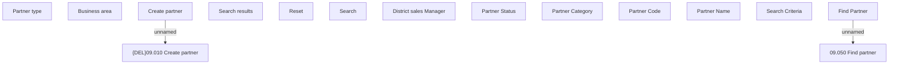

# Find partner

```mermaid
graph TD
    Partner_type["Partner type"]
    Business_area["Business area"]
    n_09_050_Find_partner["09.050 Find partner"]
    DEL_09_010_Create_partner["{DEL}09.010 Create partner"]
    Create_partner["Create partner"]
    Search_results["Search results"]
    Reset["Reset"]
    Search["Search"]
    District_sales_Manager["District sales Manager"]
    Partner_Status["Partner Status"]
    Partner_Category["Partner Category"]
    Partner_Code["Partner Code"]
    Partner_Name["Partner Name"]
    Search_Criteria["Search Criteria"]
    Find_Partner["Find Partner"]
    Create_partner -->|unnamed| DEL_09_010_Create_partner
    Find_Partner -->|unnamed| n_09_050_Find_partner
```
