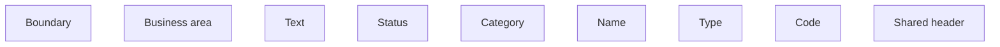

# Shared header

```mermaid
graph TD
    el_1572087["Boundary"]
    Business_area["Business area"]
    el_1572055["Text"]
    Status["Status"]
    Category["Category"]
    Name["Name"]
    Type["Type"]
    Code["Code"]
    Shared_header["Shared header"]
```
