# Show partner detail

- **Diagram Type**: Custom
- **Package**: HomerSelect/BSL/Analysis Model/Sales Network Management/Partner/COMMON for Partner/User Interface
- **Diagram ID**: 132924
- **Elements**: 37
- **Connectors**: 7

```mermaid
graph TD
    ADD_Partner_Settlement_allowed["{ADD}Partner Settlement allowed"]
    Extended_properties["Extended properties"]
    Legal_Form["Legal Form"]
    Show_available_disbursement_channels["Show available disbursement channels"]
    Company_Registry_Number["Company Registry Number"]
    Salesrooms["Salesrooms"]
    Partner_code["Partner code"]
    Addresses["Addresses"]
    Bank_Accounts["Bank Accounts"]
    Contact_Persons["Contact Persons"]
    Contact_Information["Contact Information"]
    Notices["Notices"]
    n_09_030_Show_partner["09.030 Show partner"]
    n_09_210_Set_payment_status_for_Partner_manually["09.210 Set payment status for Partner manually"]
    n_09_040_Change_status_of_partner_manually["09.040 Change status of partner manually"]
    DEL_09_020_Update_partner["{DEL}09.020 Update partner"]
    Disable_payments["Disable payments"]
    Allow_payments["Allow payments"]
    Close["Close"]
    Block["Block"]
    Activate["Activate"]
    Update_partner["Update partner"]
    PAN_Number["PAN Number"]
    Partner_Name["Partner Name"]
    Risk_and_security_check["Risk and security check"]
    Business_area["Business area"]
    Partner_type["Partner type"]
    Tax_identification_number["Tax identification number"]
    Licence_Number["Licence Number"]
    Group_Partner_Number["Group Partner Number"]
    District_Sales_Manager["District Sales Manager"]
    Partner_Category["Partner Category"]
    Payment_status["Payment status"]
    Partner_status["Partner status"]
    Contract_sign_date["Contract sign date"]
    Detail_of_Partner["Detail of Partner"]
    Detail_of_Partner["Detail of Partner"]
    Update_partner -->|unnamed| DEL_09_020_Update_partner
    Close -->|unnamed| n_09_040_Change_status_of_partner_manually
    Activate -->|unnamed| n_09_040_Change_status_of_partner_manually
    Block -->|unnamed| n_09_040_Change_status_of_partner_manually
    Allow_payments -->|unnamed| n_09_210_Set_payment_status_for_Partner_manually
    Disable_payments -->|unnamed| n_09_210_Set_payment_status_for_Partner_manually
    Detail_of_Partner -->|unnamed| n_09_030_Show_partner
```

