# tab Salesrooms

- **Diagram Type**: Custom
- **Package**: HomerSelect/BSL/Analysis Model/Sales Network Management/Partner/COMMON for Partner/User Interface
- **Diagram ID**: 132921
- **Elements**: 11
- **Connectors**: 9

```mermaid
graph TD
    Move_salesroom["Move salesroom"]
    Show_salesroom_detail["Show salesroom detail"]
    Create_Update_Salesroom["Create/Update Salesroom"]
    Salesrooms["Salesrooms"]
    n_09_220_Create_salesroom["09.220 Create salesroom"]
    n_09_230_Update_salesroom["09.230 Update salesroom"]
    n_09_240_Show_salesroom["09.240 Show salesroom"]
    n_09_350_Move_salesroom["09.350 Move salesroom"]
    n_09_030_Show_partner["09.030 Show partner"]
    Create_salesroom["Create salesroom"]
    tab_Salesrooms["tab Salesrooms"]
    tab_Salesrooms -->|unnamed| n_09_030_Show_partner
    Salesrooms -->|unnamed| n_09_350_Move_salesroom
    Salesrooms -->|unnamed| n_09_240_Show_salesroom
    Salesrooms -->|unnamed| n_09_230_Update_salesroom
    Create_salesroom -->|unnamed| n_09_220_Create_salesroom
    Create_salesroom -->|unnamed| Create_Update_Salesroom
    Salesrooms -->|unnamed| Create_Update_Salesroom
    Salesrooms -->|unnamed| Show_salesroom_detail
    Salesrooms -->|unnamed| Move_salesroom
```

