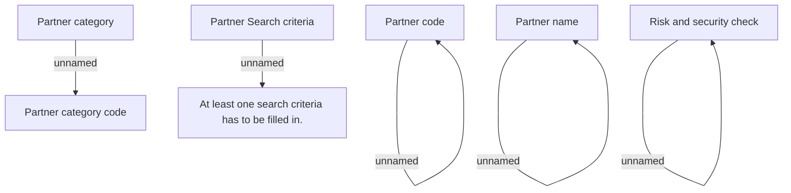

# Partner validation rules - Common

```mermaid
graph TD
    Partner_code["Partner code"]
    Partner_code["Partner code"]
    Partner_name["Partner name"]
    Partner_category["Partner category"]
    Partner_category_code["Partner category code"]
    Risk_and_security_check["Risk and security check"]
    Risk_and_security_check["Risk and security check"]
    At_least_one_search_criteria_has_to_be_filled_in["At least one search criteria has to be filled in."]
    Partner_Search_criteria["Partner Search criteria"]
    Partner_name["Partner name"]
    Partner_code -->|unnamed| Partner_code
    Risk_and_security_check -->|unnamed| Risk_and_security_check
    Partner_Search_criteria -->|unnamed| At_least_one_search_criteria_has_to_be_filled_in
    Partner_category -->|unnamed| Partner_category_code
    Partner_name -->|unnamed| Partner_name
```
