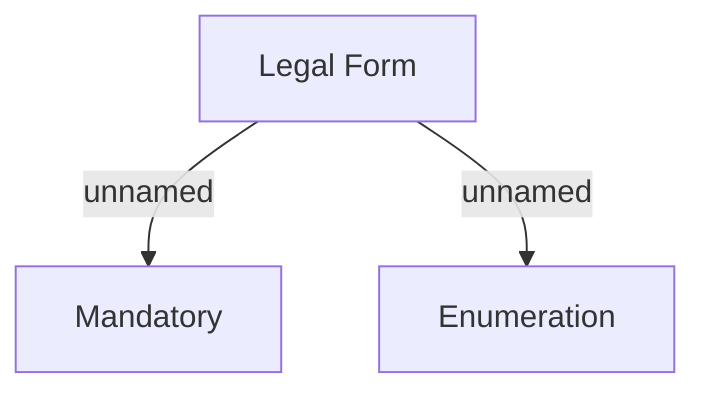

# KZ specific rules

- **Diagram Type**: Custom
- **Package**: HomerSelect/BSL/Analysis Model/Sales Network Management/Partner/COMMON for Partner/Validation rules/KZ 
- **Diagram ID**: 62737
- **Elements**: 3
- **Connectors**: 2

