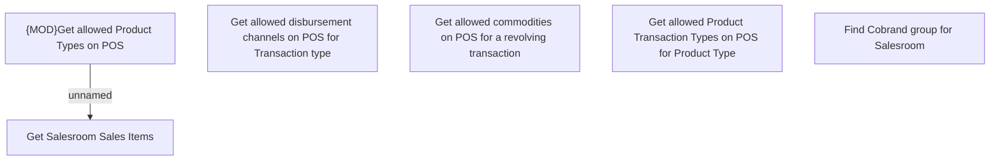

# Get Salesroom Properties - business rules

- **Diagram Type**: Custom
- **Package**: HomerSelect/BSL/Analysis Model/Sales Network Management/Salesroom/COMMON for Salesroom/Business Rules/Common for all variants
- **Diagram ID**: 138422
- **Elements**: 6
- **Connectors**: 1

