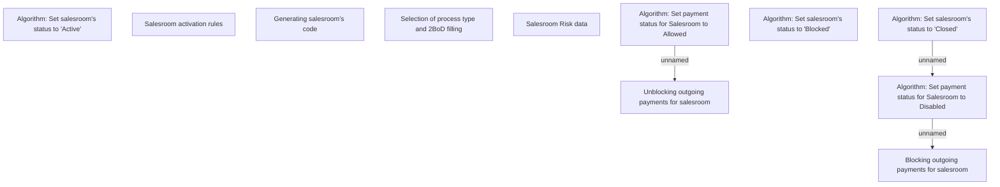

# Salesroom Management -  business Rules

```mermaid
graph TD
    Unblocking_outgoing_payments_for_salesroom["Unblocking outgoing payments for salesroom"]
    Blocking_outgoing_payments_for_salesroom["Blocking outgoing payments for salesroom"]
    Algorithm_Set_salesroom_s_status_to_Active["Algorithm: Set salesroom's status to 'Active'"]
    Salesroom_activation_rules["Salesroom activation rules"]
    Generating_salesroom_s_code["Generating salesroom’s code"]
    Selection_of_process_type_and_2BoD_filling["Selection of process type and 2BoD filling"]
    Salesroom_Risk_data["Salesroom Risk data"]
    Algorithm_Set_salesroom_s_status_to_Closed["Algorithm: Set salesroom's status to 'Closed'"]
    Algorithm_Set_salesroom_s_status_to_Blocked["Algorithm: Set salesroom's status to 'Blocked'"]
    Algorithm_Set_payment_status_for_Salesroom_to_Disabled["Algorithm: Set payment status for Salesroom to Disabled"]
    Algorithm_Set_payment_status_for_Salesroom_to_Allowed["Algorithm: Set payment status for Salesroom to Allowed"]
    Algorithm_Set_salesroom_s_status_to_Closed -->|unnamed| Algorithm_Set_payment_status_for_Salesroom_to_Disabled
    Algorithm_Set_payment_status_for_Salesroom_to_Disabled -->|unnamed| Blocking_outgoing_payments_for_salesroom
    Algorithm_Set_payment_status_for_Salesroom_to_Allowed -->|unnamed| Unblocking_outgoing_payments_for_salesroom
```
