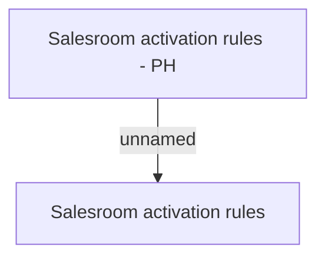

# BR: Salesroom

- **Diagram Type**: Custom
- **Package**: HomerSelect/BSL/Analysis Model/Sales Network Management/Salesroom/COMMON for Salesroom/Business Rules/PH
- **Diagram ID**: 62761
- **Elements**: 2
- **Connectors**: 1

