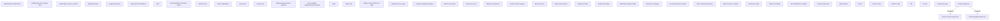

# Create/Update Salesroom

```mermaid
graph TD
    ADD_Partner_Settlement["{ADD}Partner Settlement"]
    ADD_Salesroom_feature_type["{ADD}Salesroom feature type"]
    DEL_Sign_consent_via_OTP["{DEL}Sign consent via OTP"]
    DEL_Paperless["{DEL}Paperless"]
    Fingerprint_device["Fingerprint device"]
    Merchant_URL_Address["Merchant URL Address"]
    URL["URL"]
    Edit_Available_Document_Types["Edit Available Document Types"]
    Card_Pick_Up["Card Pick Up"]
    Send_notifications["Send notifications"]
    Sales_area["Sales area"]
    Legal_Form["Legal Form"]
    Manual_disbursement_allowed["Manual disbursement allowed"]
    Edit_available_disbursement_channels["Edit available disbursement channels"]
    Code["Code"]
    Web_Cam["Web Cam"]
    Filling_of_second_block_of_data["Filling of second block of data"]
    Allowed_process_type["Allowed process type"]
    n_09_230_Update_salesroom["09.230 Update salesroom"]
    n_09_220_Create_salesroom["09.220 Create salesroom"]
    Company_Registry_Number["Company Registry Number"]
    Online_connection["Online connection"]
    Shop_size_in_m2["Shop size in m2"]
    Moment_of_payment["Moment of payment"]
    District_sales_manager["District sales manager"]
    Business_area["Business area"]
    Salesroom_features["Salesroom features"]
    Payment_status["Payment status"]
    Salesroom_status["Salesroom status"]
    Motivation_program_date["Motivation program date"]
    Salesroom_category["Salesroom category"]
    Group_salesroom_number["Group salesroom number"]
    Date_of_planned_opening["Date of planned opening"]
    Branch_licence_number["Branch licence number"]
    Business_model["Business model"]
    Date_of_checking["Date of checking"]
    Tax_identification_number["Tax identification number"]
    Contract_sign_date["Contract sign date"]
    PAN_number["PAN number"]
    Name["Name"]
    Partner_name["Partner name"]
    Partner_code["Partner code"]
    OK["OK"]
    Cancel["Cancel"]
    Salesroom_type["Salesroom type"]
    Create_salesroom["Create salesroom"]
    Create_salesroom -->|unnamed| n_09_220_Create_salesroom
    Create_salesroom -->|unnamed| n_09_230_Update_salesroom
```
