# Find Salesroom

- **Diagram Type**: Custom
- **Package**: HomerSelect/BSL/Analysis Model/Sales Network Management/Salesroom/COMMON for Salesroom/User Interface
- **Diagram ID**: 132928
- **Elements**: 13
- **Connectors**: 0

```mermaid
graph TD
    Search_Results["Search Results"]
    Reset["Reset"]
    Search["Search"]
    Salesroom_category["Salesroom category"]
    Salesroom_status["Salesroom status"]
    Business_area["Business area"]
    District_sales_manager["District sales manager"]
    Salesroom_name["Salesroom name"]
    Salesroom_code["Salesroom code"]
    Partner_code["Partner code"]
    Partner_name["Partner name"]
    Search_criteria["Search criteria"]
    Search_criteria_input_form["Search criteria - input form"]
```

