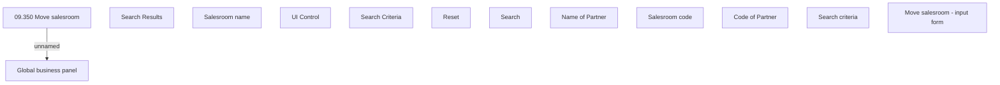

# Move salesroom

```mermaid
graph TD
    n_09_350_Move_salesroom["09.350 Move salesroom"]
    Global_business_panel["Global business panel"]
    Search_Results["Search Results"]
    Search_Results["Search Results"]
    Salesroom_name["Salesroom name"]
    UI_Control["UI Control"]
    Search_Criteria["Search Criteria"]
    Reset["Reset"]
    Search["Search"]
    Name_of_Partner["Name of Partner"]
    Salesroom_code["Salesroom code"]
    Code_of_Partner["Code of Partner"]
    Search_criteria["Search criteria"]
    Move_salesroom_input_form["Move salesroom - input form"]
    n_09_350_Move_salesroom -->|unnamed| Global_business_panel
```
