# Show salesroom detail

- **Diagram Type**: Custom
- **Package**: HomerSelect/BSL/Analysis Model/Sales Network Management/Salesroom/COMMON for Salesroom/User Interface
- **Diagram ID**: 132929
- **Elements**: 65
- **Connectors**: 8

```mermaid
graph TD
    ADD_Partner_Settlement["{ADD}Partner Settlement"]
    ADD_Salesroom_feature_flags["{ADD}Salesroom feature flags"]
    ADD_Sales_Packages["{ADD}Sales Packages"]
    DEL_Sign_consent_via_OTP["{DEL}Sign consent via OTP"]
    DEL_Paperless["{DEL}Paperless"]
    Fingerprint_device["Fingerprint device"]
    Merchant_URL_Address["Merchant URL Address"]
    URL["URL"]
    Show_Available_Document_Types["Show Available Document Types"]
    Card_Pick_Up["Card Pick Up"]
    Send_notifications["Send notifications"]
    Sales_area["Sales area"]
    Legal_Form["Legal Form"]
    Manual_disbursement_allowed["Manual disbursement allowed"]
    Show_available_disbursement_channels["Show available disbursement channels"]
    n_09_215_Set_payment_status_for_Salesroom_manually["09.215 Set payment status for Salesroom manually"]
    Notices["Notices"]
    Contact_Information["Contact Information"]
    Contact_Persons["Contact Persons"]
    Bank_Accounts["Bank Accounts"]
    Addresses["Addresses"]
    Extended_properties["Extended properties"]
    WebCam["WebCam"]
    Commodities["Commodities"]
    Sales_Agents["Sales Agents"]
    MOD_Credit_products["{MOD}Credit products"]
    Company_Registry_Number["Company Registry Number"]
    Filling_of_second_block_of_data["Filling of second block of data"]
    Allowed_process_type["Allowed process type"]
    Online_connection["Online connection"]
    Shop_size_in_m2["Shop size in m2"]
    Payment_status["Payment status"]
    Status["Status"]
    Group_salesroom_number["Group salesroom number"]
    Date_of_checking["Date of checking"]
    Tax_identification_number["Tax identification number"]
    PAN_Number["PAN Number"]
    Partner_code["Partner code"]
    Moment_of_payment["Moment of payment"]
    Salesroom_features["Salesroom features"]
    Motivation_program_date["Motivation program date"]
    Date_of_planned_opening["Date of planned opening"]
    Business_model["Business model"]
    Contract_sign_date["Contract sign date"]
    District_salesroom_manager["District salesroom manager"]
    Business_area["Business area"]
    Salesroom_Category["Salesroom Category"]
    Branch_license_number["Branch license number"]
    Salesroom_type["Salesroom type"]
    Code["Code"]
    Name["Name"]
    Partner_Name["Partner Name"]
    n_09_260_Change_salesroom_status_manually["09.260 Change salesroom status manually"]
    n_09_240_Show_salesroom["09.240 Show salesroom"]
    n_09_230_Update_salesroom["09.230 Update salesroom"]
    n_09_030_Show_partner["09.030 Show partner"]
    Detail_of_Partner["Detail of Partner"]
    Disable_payments["Disable payments"]
    Allow_payments["Allow payments"]
    Close_salesroom["Close salesroom"]
    Block_salesroom["Block salesroom"]
    Activate_salesroom["Activate salesroom"]
    Update_salesroom["Update salesroom"]
    Detail_of_Salesroom["Detail of Salesroom"]
    Detail_of_Salesroom["Detail of Salesroom"]
    Detail_of_Partner -->|unnamed| n_09_030_Show_partner
    Update_salesroom -->|unnamed| n_09_230_Update_salesroom
    Detail_of_Salesroom -->|unnamed| n_09_240_Show_salesroom
    Close_salesroom -->|unnamed| n_09_260_Change_salesroom_status_manually
    Block_salesroom -->|unnamed| n_09_260_Change_salesroom_status_manually
    Activate_salesroom -->|unnamed| n_09_260_Change_salesroom_status_manually
    Allow_payments -->|unnamed| n_09_215_Set_payment_status_for_Salesroom_manually
    Disable_payments -->|unnamed| n_09_215_Set_payment_status_for_Salesroom_manually
```

