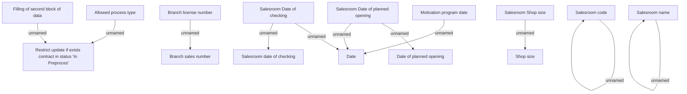

# Salesroom validation rules - Common

```mermaid
graph TD
    Restrict_update_if_exists_contract_in_status_In_Preproces["Restrict update if exists contract in status 'In Preproces'"]
    Allowed_process_type["Allowed process type"]
    Filling_of_second_block_of_data["Filling of second block of data"]
    Salesroom_code["Salesroom code"]
    Salesroom_code["Salesroom code"]
    Branch_sales_number["Branch sales number"]
    Salesroom_date_of_checking["Salesroom date of checking"]
    Salesroom_name["Salesroom name"]
    Motivation_program_date["Motivation program date"]
    Branch_license_number["Branch license number"]
    Salesroom_name["Salesroom name"]
    Salesroom_Date_of_checking["Salesroom Date of checking"]
    Date["Date"]
    Salesroom_Date_of_planned_opening["Salesroom Date of planned opening"]
    Salesroom_Shop_size["Salesroom Shop size"]
    Shop_size["Shop size"]
    Date_of_planned_opening["Date of planned opening"]
    Salesroom_Date_of_planned_opening -->|unnamed| Date_of_planned_opening
    Salesroom_Shop_size -->|unnamed| Shop_size
    Motivation_program_date -->|unnamed| Date
    Salesroom_Date_of_checking -->|unnamed| Date
    Salesroom_Date_of_planned_opening -->|unnamed| Date
    Salesroom_name -->|unnamed| Salesroom_name
    Salesroom_Date_of_checking -->|unnamed| Salesroom_date_of_checking
    Branch_license_number -->|unnamed| Branch_sales_number
    Salesroom_code -->|unnamed| Salesroom_code
    Allowed_process_type -->|unnamed| Restrict_update_if_exists_contract_in_status_In_Preproces
    Filling_of_second_block_of_data -->|unnamed| Restrict_update_if_exists_contract_in_status_In_Preproces
```
