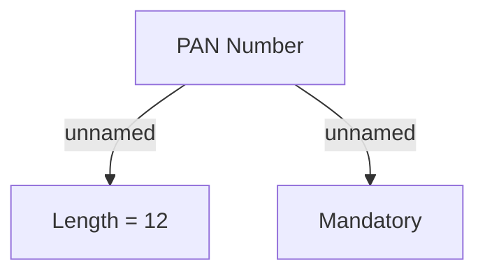

# KZ specific rules

- **Diagram Type**: Custom
- **Package**: HomerSelect/BSL/Analysis Model/Sales Network Management/Salesroom/COMMON for Salesroom/Validation rules/KZ
- **Diagram ID**: 63269
- **Elements**: 3
- **Connectors**: 2

