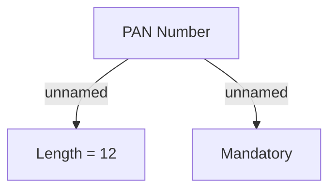

# KZ specific rules

```mermaid
graph TD
    Mandatory["Mandatory"]
    Length_12["Length = 12"]
    PAN_Number["PAN Number"]
    PAN_Number -->|unnamed| Length_12
    PAN_Number -->|unnamed| Mandatory
```
