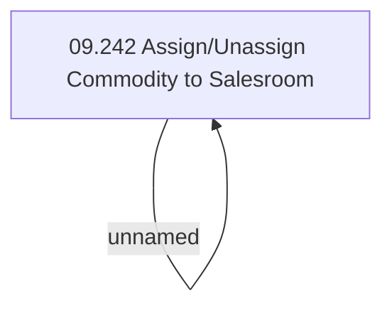

# Access Rights

- **Diagram Type**: Custom
- **Package**: HomerSelect/BSL/Analysis Model/Sales Network Management/Salesroom/Commodities on Salesroom/Access Rights
- **Diagram ID**: 39194
- **Elements**: 2
- **Connectors**: 1

