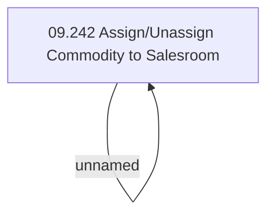

# Access Rights

```mermaid
graph TD
    n_09_242_Assign_Unassign_Commodity_to_Salesroom["09.242 Assign/Unassign Commodity to Salesroom"]
    n_09_242_Assign_Unassign_Commodity_to_Salesroom["09.242 Assign/Unassign Commodity to Salesroom"]
    n_09_242_Assign_Unassign_Commodity_to_Salesroom -->|unnamed| n_09_242_Assign_Unassign_Commodity_to_Salesroom
```
