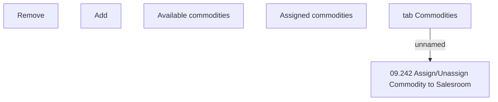

# tab Commodities

- **Diagram Type**: Custom
- **Package**: HomerSelect/BSL/Analysis Model/Sales Network Management/Salesroom/Commodities on Salesroom/User Interface
- **Diagram ID**: 140924
- **Elements**: 6
- **Connectors**: 1

