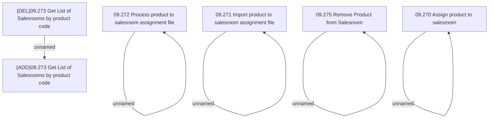

# Products on Salesroom - Access Rights

- **Diagram Type**: Custom
- **Package**: HomerSelect/BSL/Analysis Model/Sales Network Management/Salesroom/Products on Salesroom/Access Rights
- **Diagram ID**: 107710
- **Elements**: 10
- **Connectors**: 5

