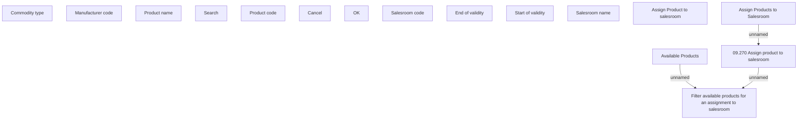

# Assign product to salesroom

- **Diagram Type**: Custom
- **Package**: HomerSelect/BSL/Analysis Model/Sales Network Management/Salesroom/Products on Salesroom/User Interface
- **Diagram ID**: 149536
- **Elements**: 16
- **Connectors**: 3

