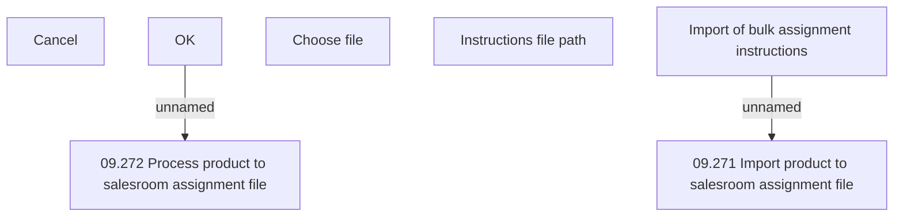

# Import bulk assignment file

```mermaid
graph TD
    n_09_272_Process_product_to_salesroom_assignment_file["09.272 Process product to salesroom assignment file"]
    n_09_271_Import_product_to_salesroom_assignment_file["09.271 Import product to salesroom assignment file"]
    Cancel["Cancel"]
    OK["OK"]
    Choose_file["Choose file"]
    Instructions_file_path["Instructions file path"]
    Import_of_bulk_assignment_instructions["Import of bulk assignment instructions"]
    Import_of_bulk_assignment_instructions -->|unnamed| n_09_271_Import_product_to_salesroom_assignment_file
    OK -->|unnamed| n_09_272_Process_product_to_salesroom_assignment_file
```
