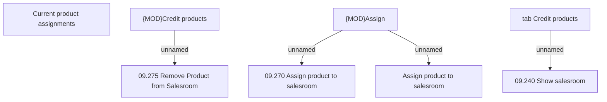

# tab Credit products

```mermaid
graph TD
    Current_product_assignments["Current product assignments"]
    n_09_240_Show_salesroom["09.240 Show salesroom"]
    Assign_product_to_salesroom["Assign product to salesroom"]
    MOD_Credit_products["{MOD}Credit products"]
    MOD_Assign["{MOD}Assign"]
    n_09_270_Assign_product_to_salesroom["09.270 Assign product to salesroom"]
    n_09_275_Remove_Product_from_Salesroom["09.275 Remove Product from Salesroom"]
    tab_Credit_products["tab Credit products"]
    MOD_Credit_products -->|unnamed| n_09_275_Remove_Product_from_Salesroom
    MOD_Assign -->|unnamed| n_09_270_Assign_product_to_salesroom
    MOD_Assign -->|unnamed| Assign_product_to_salesroom
    tab_Credit_products -->|unnamed| n_09_240_Show_salesroom
```
