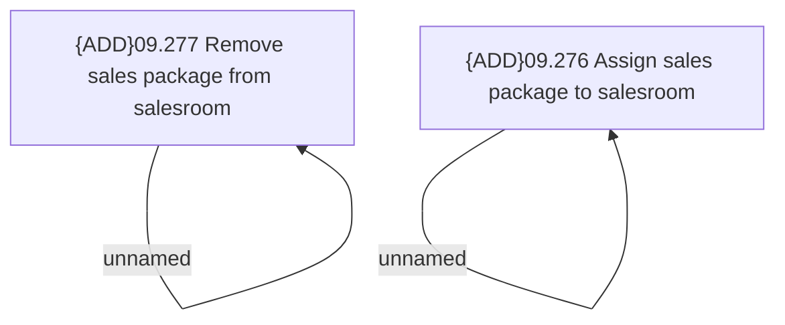

# Access Rights

```mermaid
graph TD
    ADD_09_277_Remove_sales_package_from_salesroom["{ADD}09.277 Remove sales package from salesroom"]
    ADD_09_276_Assign_sales_package_to_salesroom["{ADD}09.276 Assign sales package to salesroom"]
    ADD_09_277_Remove_sales_package_from_salesroom["{ADD}09.277 Remove sales package from salesroom"]
    ADD_09_276_Assign_sales_package_to_salesroom["{ADD}09.276 Assign sales package to salesroom"]
    ADD_09_277_Remove_sales_package_from_salesroom -->|unnamed| ADD_09_277_Remove_sales_package_from_salesroom
    ADD_09_276_Assign_sales_package_to_salesroom -->|unnamed| ADD_09_276_Assign_sales_package_to_salesroom
```
