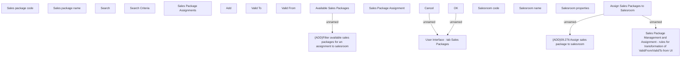

# Assign Sales Package to Salesroom

```mermaid
graph TD
    Sales_Package_Management_and_Assignment_rules_for_transforma["Sales Package Management and Assignment - rules for transformation of ValidFrom/ValidTo from UI"]
    Sales_package_code["Sales package code"]
    Sales_package_name["Sales package name"]
    Search["Search"]
    Search_Criteria["Search Criteria"]
    ADD_Filter_available_sales_packages_for_an_assignment_to_sal["{ADD}Filter available sales packages for an assignment to salesroom"]
    Sales_Package_Assignments["Sales Package Assignments"]
    Add["Add"]
    Valid_To["Valid To"]
    Valid_From["Valid From"]
    Available_Sales_Packages["Available Sales Packages"]
    Sales_Package_Assignment["Sales Package Assignment"]
    ADD_09_276_Assign_sales_package_to_salesroom["{ADD}09.276 Assign sales package to salesroom"]
    Cancel["Cancel"]
    OK["OK"]
    Salesroom_code["Salesroom code"]
    Salesroom_name["Salesroom name"]
    Salesroom_properties["Salesroom properties"]
    Assign_Sales_Packages_to_Salesroom["Assign Sales Packages to Salesroom"]
    User_Interface_tab_Sales_Packages["User Interface : tab Sales Packages"]
    Cancel -->|unnamed| User_Interface_tab_Sales_Packages
    OK -->|unnamed| User_Interface_tab_Sales_Packages
    Assign_Sales_Packages_to_Salesroom -->|unnamed| ADD_09_276_Assign_sales_package_to_salesroom
    Available_Sales_Packages -->|unnamed| ADD_Filter_available_sales_packages_for_an_assignment_to_sal
    Assign_Sales_Packages_to_Salesroom -->|unnamed| Sales_Package_Management_and_Assignment_rules_for_transforma
```
