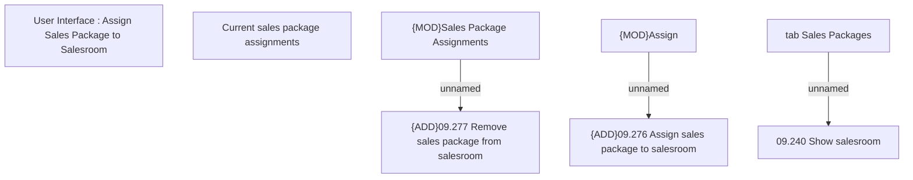

# tab Sales Packages

- **Diagram Type**: Custom
- **Package**: HomerSelect/BSL/Analysis Model/Sales Network Management/Salesroom/Sales Packages on Salesroom/User Interface
- **Diagram ID**: 149523
- **Elements**: 8
- **Connectors**: 3

