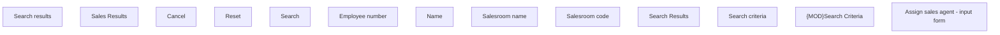

# Assign Sales Agents

```mermaid
graph TD
    Search_results["Search results"]
    Sales_Results["Sales Results"]
    Cancel["Cancel"]
    Reset["Reset"]
    Search["Search "]
    Search["Search"]
    Employee_number["Employee number"]
    Name["Name"]
    Salesroom_name["Salesroom name"]
    Salesroom_code["Salesroom code"]
    Search_Results["Search Results"]
    Search_criteria["Search criteria"]
    MOD_Search_Criteria["{MOD}Search Criteria"]
    Assign_sales_agent_input_form["Assign sales agent - input form"]
```
