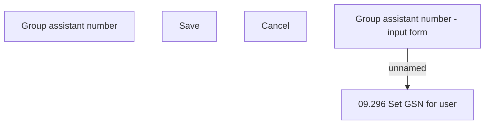

# Set GSN of user

- **Diagram Type**: Custom
- **Package**: HomerSelect/BSL/Analysis Model/Sales Network Management/Salesroom/Sales agents on Salesroom /User Interface/Set GSN of user
- **Diagram ID**: 79859
- **Elements**: 5
- **Connectors**: 1

