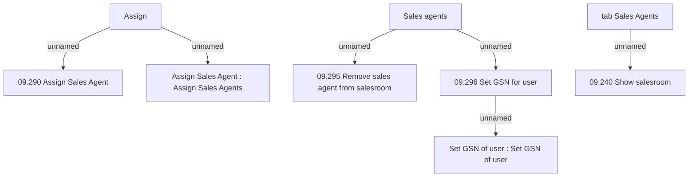

# tab Sales Agents

```mermaid
graph TD
    Set_GSN_of_user_Set_GSN_of_user["Set GSN of user : Set GSN of user"]
    n_09_296_Set_GSN_for_user["09.296 Set GSN for user"]
    Assign_Sales_Agent_Assign_Sales_Agents["Assign Sales Agent : Assign Sales Agents"]
    Assign["Assign"]
    Sales_agents["Sales agents"]
    n_09_240_Show_salesroom["09.240 Show salesroom"]
    n_09_290_Assign_Sales_Agent["09.290 Assign Sales Agent"]
    n_09_295_Remove_sales_agent_from_salesroom["09.295 Remove sales agent from salesroom"]
    tab_Sales_Agents["tab Sales Agents"]
    Sales_agents -->|unnamed| n_09_295_Remove_sales_agent_from_salesroom
    Assign -->|unnamed| n_09_290_Assign_Sales_Agent
    tab_Sales_Agents -->|unnamed| n_09_240_Show_salesroom
    Assign -->|unnamed| Assign_Sales_Agent_Assign_Sales_Agents
    Sales_agents -->|unnamed| n_09_296_Set_GSN_for_user
    n_09_296_Set_GSN_for_user -->|unnamed| Set_GSN_of_user_Set_GSN_of_user
```
