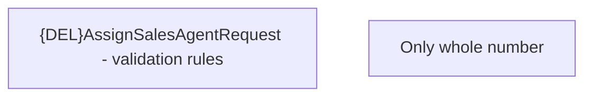

# Validation Rules

- **Diagram Type**: Custom
- **Package**: HomerSelect/BSL/Analysis Model/Sales Network Management/Salesroom/Sales agents on Salesroom /Validation Rules
- **Diagram ID**: 150997
- **Elements**: 2
- **Connectors**: 0

