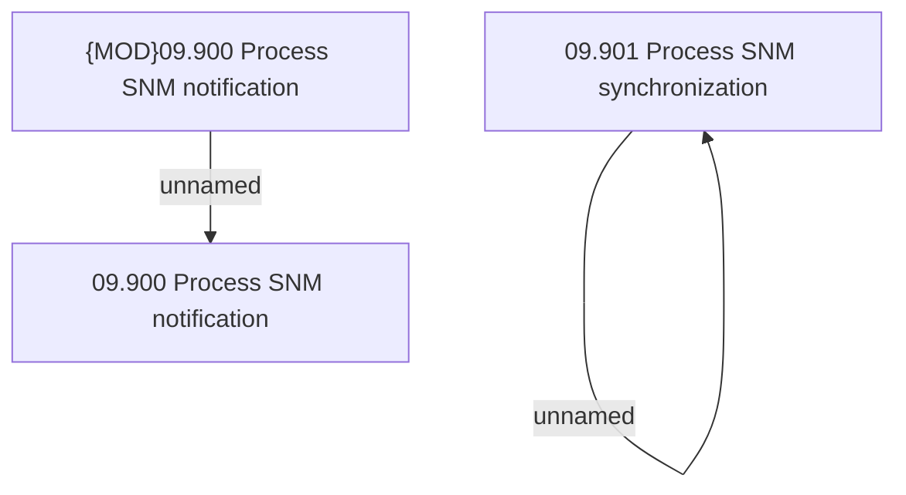

# Access rights for Synchronization of SNM data

```mermaid
graph TD
    n_09_901_Process_SNM_synchronization["09.901 Process SNM synchronization"]
    MOD_09_900_Process_SNM_notification["{MOD}09.900 Process SNM notification"]
    n_09_901_Process_SNM_synchronization["09.901 Process SNM synchronization"]
    n_09_900_Process_SNM_notification["09.900 Process SNM notification"]
    MOD_09_900_Process_SNM_notification -->|unnamed| n_09_900_Process_SNM_notification
    n_09_901_Process_SNM_synchronization -->|unnamed| n_09_901_Process_SNM_synchronization
```
