# SNM Partner and Salesroom Synchronization

- **Diagram Type**: Custom
- **Package**: HomerSelect/BSL/Analysis Model/Sales Network Management/Synchronization/Business rules
- **Diagram ID**: 136711
- **Elements**: 27
- **Connectors**: 23

```mermaid
graph TD
    SN_synchronization_Experimental_feature["SN synchronization - Experimental feature"]
    SN_synchronization_Salesroom_other_attributes["SN synchronization - Salesroom other attributes"]
    Salesroom_SNM_Salesroom_Synchronization["Salesroom : SNM Salesroom Synchronization"]
    Partner_SNM_Partner_Synchronization["Partner : SNM Partner Synchronization"]
    Business_rules_SNM_Synchronization["Business rules : SNM Synchronization"]
    MOD_SNM_Partner_and_Salesroom_Synchronization["{MOD}SNM Partner and Salesroom Synchronization"]
    SN_synchronization_Sales_area["SN synchronization - Sales area"]
    SN_synchronization_Salesroom_document_types["SN synchronization - Salesroom document types"]
    SN_synchronization_Cobrand_groups["SN synchronization - Cobrand groups"]
    SN_synchronization_Contact_persons["SN synchronization - Contact persons"]
    Algorithm_Set_salesroom_s_status_to_Closed["Algorithm: Set salesroom's status to 'Closed'"]
    SN_synchronization_Other_attributes["SN synchronization - Other attributes"]
    SN_synchronization_Bank_accounts["SN synchronization - Bank accounts"]
    Algorithm_Set_payment_status_for_Partner_to_Allowed["Algorithm: Set payment status for Partner to Allowed"]
    Algorithm_Set_payment_status_for_Partner_to_Disabled["Algorithm: Set payment status for Partner to Disabled"]
    Algorithm_Set_payment_status_for_Salesroom_to_Allowed["Algorithm: Set payment status for Salesroom to Allowed"]
    Algorithm_Set_payment_status_for_Salesroom_to_Disabled["Algorithm: Set payment status for Salesroom to Disabled"]
    MOD_Algorithm_Set_partners_s_status_to_Closed["{MOD}Algorithm: Set partners's status to 'Closed'"]
    Algorithm_Set_partners_s_status_to_Blocked["Algorithm: Set partners's status to 'Blocked'"]
    Algorithm_Set_partners_s_status_to_Active["Algorithm: Set partners's status to 'Active'"]
    Algorithm_Set_salesroom_s_status_to_Blocked["Algorithm: Set salesroom's status to 'Blocked'"]
    Algorithm_Set_salesroom_s_status_to_Active["Algorithm: Set salesroom's status to 'Active'"]
    SN_synchronization_Salesmans["SN synchronization - Salesmans"]
    SN_synchronization_Business_areas["SN synchronization - Business areas"]
    SN_synchronization_Payment_status["SN synchronization - Payment status"]
    SN_synchronization_Status["SN synchronization - Status"]
    SN_synchronization_Users["SN synchronization - Users"]
    MOD_SNM_Partner_and_Salesroom_Synchronization -->|unnamed| SN_synchronization_Salesroom_other_attributes
    MOD_SNM_Partner_and_Salesroom_Synchronization -->|unnamed| SN_synchronization_Sales_area
    MOD_SNM_Partner_and_Salesroom_Synchronization -->|unnamed| SN_synchronization_Salesroom_document_types
    MOD_SNM_Partner_and_Salesroom_Synchronization -->|unnamed| SN_synchronization_Cobrand_groups
    MOD_SNM_Partner_and_Salesroom_Synchronization -->|unnamed| SN_synchronization_Contact_persons
    SN_synchronization_Status -->|unnamed| Algorithm_Set_salesroom_s_status_to_Closed
    MOD_SNM_Partner_and_Salesroom_Synchronization -->|unnamed| SN_synchronization_Other_attributes
    MOD_SNM_Partner_and_Salesroom_Synchronization -->|unnamed| SN_synchronization_Bank_accounts
    SN_synchronization_Payment_status -->|unnamed| Algorithm_Set_payment_status_for_Partner_to_Allowed
    MOD_SNM_Partner_and_Salesroom_Synchronization -->|unnamed| SN_synchronization_Experimental_feature
    SN_synchronization_Payment_status -->|unnamed| Algorithm_Set_payment_status_for_Salesroom_to_Allowed
    MOD_SNM_Partner_and_Salesroom_Synchronization -->|unnamed| SN_synchronization_Users
    SN_synchronization_Payment_status -->|unnamed| Algorithm_Set_payment_status_for_Salesroom_to_Disabled
    SN_synchronization_Status -->|unnamed| MOD_Algorithm_Set_partners_s_status_to_Closed
    SN_synchronization_Status -->|unnamed| Algorithm_Set_partners_s_status_to_Blocked
    SN_synchronization_Status -->|unnamed| Algorithm_Set_partners_s_status_to_Active
    SN_synchronization_Status -->|unnamed| Algorithm_Set_salesroom_s_status_to_Blocked
    SN_synchronization_Status -->|unnamed| Algorithm_Set_salesroom_s_status_to_Active
    MOD_SNM_Partner_and_Salesroom_Synchronization -->|unnamed| SN_synchronization_Salesmans
    MOD_SNM_Partner_and_Salesroom_Synchronization -->|unnamed| SN_synchronization_Business_areas
    MOD_SNM_Partner_and_Salesroom_Synchronization -->|unnamed| SN_synchronization_Payment_status
    MOD_SNM_Partner_and_Salesroom_Synchronization -->|unnamed| SN_synchronization_Status
    SN_synchronization_Payment_status -->|unnamed| Algorithm_Set_payment_status_for_Partner_to_Disabled
```

