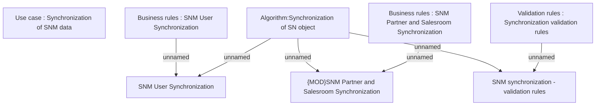

# SNM Synchronization

- **Diagram Type**: Custom
- **Package**: HomerSelect/BSL/Analysis Model/Sales Network Management/Synchronization/Business rules
- **Diagram ID**: 136710
- **Elements**: 8
- **Connectors**: 6

