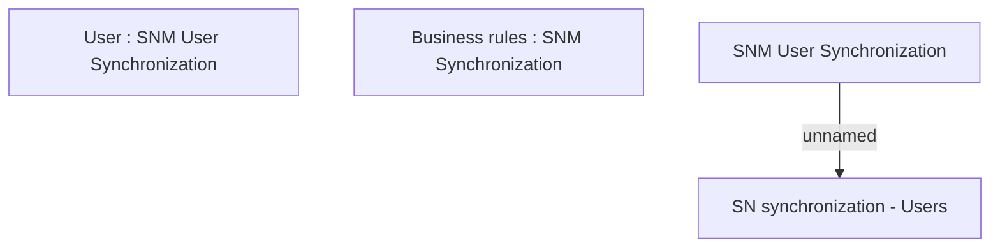

# SNM User Synchronization

```mermaid
graph TD
    User_SNM_User_Synchronization["User : SNM User Synchronization"]
    Business_rules_SNM_Synchronization["Business rules : SNM Synchronization"]
    SNM_User_Synchronization["SNM User Synchronization"]
    SN_synchronization_Users["SN synchronization - Users"]
    SNM_User_Synchronization -->|unnamed| SN_synchronization_Users
```
