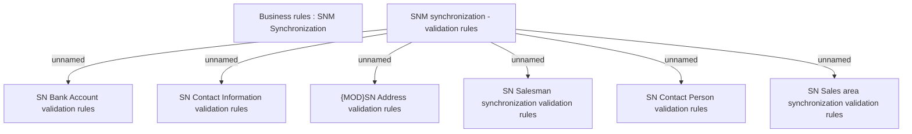

# Synchronization validation rules

- **Diagram Type**: Custom
- **Package**: HomerSelect/BSL/Analysis Model/Sales Network Management/Synchronization/Validation rules
- **Diagram ID**: 72163
- **Elements**: 8
- **Connectors**: 6

