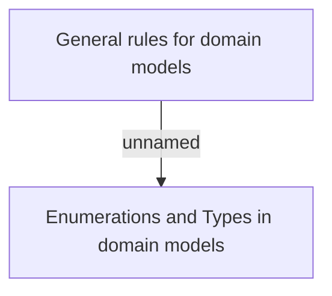

# General rules for system documentation

- **Diagram Type**: Custom
- **Package**: HomerSelect/BSL/Analysis Model/_General Rules/Documentation
- **Diagram ID**: 46609
- **Elements**: 2
- **Connectors**: 1

